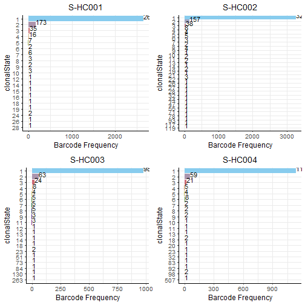
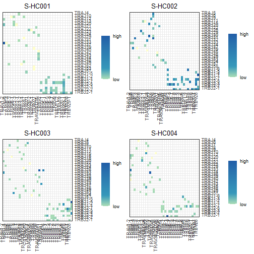

```r
rm(list=ls())
# install.packages('easypackages')
library(easypackages)
#> Warning: 程辑包'easypackages'是用R版本4.0.5 来建造的
packages <- c('RColorBrewer', 'scales', 'ggplot2', 'cowplot', 'tidyverse', 'readr', 'tidyr', 'dplyr', 'gtools',
              'forcats')
libraries(packages)
#> 载入需要的程辑包：RColorBrewer
#> 载入需要的程辑包：scales
#> 载入需要的程辑包：ggplot2
#> Warning: 程辑包'ggplot2'是用R版本4.0.5 来建造的
#> 载入需要的程辑包：cowplot
#> Warning: 程辑包'cowplot'是用R版本4.0.5 来建造的
#> 载入需要的程辑包：tidyverse
#> Warning: 程辑包'tidyverse'是用R版本4.0.5 来建造的
#> -- Attaching packages --------------------------------------- tidyverse 1.3.1 --
#> v tibble  3.1.5     v dplyr   1.0.7
#> v tidyr   1.1.4     v stringr 1.4.0
#> v readr   2.0.2     v forcats 0.5.1
#> v purrr   0.3.4
#> Warning: 程辑包'tibble'是用R版本4.0.5 来建造的
#> Warning: 程辑包'tidyr'是用R版本4.0.5 来建造的
#> Warning: 程辑包'readr'是用R版本4.0.5 来建造的
#> Warning: 程辑包'purrr'是用R版本4.0.3 来建造的
#> Warning: 程辑包'dplyr'是用R版本4.0.5 来建造的
#> Warning: 程辑包'forcats'是用R版本4.0.4 来建造的
#> -- Conflicts ------------------------------------------ tidyverse_conflicts() --
#> x readr::col_factor() masks scales::col_factor(), scImmuneGraph::col_factor()
#> x purrr::discard()    masks scales::discard(), scImmuneGraph::discard()
#> x dplyr::filter()     masks scImmuneGraph::filter(), stats::filter()
#> x dplyr::lag()        masks scImmuneGraph::lag(), stats::lag()
#> 载入需要的程辑包：gtools
#> Warning: 程辑包'gtools'是用R版本4.0.5 来建造的
#> All packages loaded successfully
# install.packages('F:/R_Language/scImmuneGraph_0.1.0.tar.gz', repos = NULL, type="source")
library(scImmuneGraph)
```

***

TCR basic information statistics


```r
contig_list <- tcontig_list
sample_name <- names(contig_list)
# contig_list <- TCR.ContigList(project_data_dir, sample_name, group_name)

multi_plots <- TCR.ClonalStateDistribution(contig_list, sample_name)
cowplot::plot_grid(plotlist=multi_plots)
```



```r

# Or all functions as the same call way
multi_plots <- BasicPlot(TCR.ClonalStateDistribution, contig_list, sample_name) # √
multi_plots <- BasicPlot(TCR.top100ClonotypeAbundance, contig_list, sample_name) # √
multi_plots <- BasicPlot(TCR.ClonotypeComposition, contig_list, sample_name) # Diversity # √
multi_plots <- BasicPlot(TCR.top100CDR3Abundance, contig_list, sample_name) # √
multi_plots <- BasicPlot(TCR.CDR3ntLengthDistribution, contig_list, sample_name) # √
multi_plots <- BasicPlot(TCR.VgeneAbundance, contig_list, sample_name) # √
multi_plots <- BasicPlot(TCR.JgeneAbundance, contig_list, sample_name) # √
multi_plots <- BasicPlot(TCR.VJgenePair, contig_list, sample_name) # √
cowplot::plot_grid(plotlist=multi_plots)
```



***

BCR basic information statistics


```r
# contig_list <- BCR.ContigList(project_data_dir, sample_name, group_name)
contig_list <- bcontig_list
sample_name <- names(contig_list)
multi_plots <- BasicPlot(BCR.ClonalStateDistribution, contig_list, sample_name) # SAME
multi_plots <- BasicPlot(BCR.top100ClonotypeAbundance, contig_list, sample_name) # SAME
multi_plots <- BasicPlot(BCR.ClonotypeComposition, contig_list, sample_name) # SAME
multi_plots <- BasicPlot(BCR.top100CDR3Abundance, contig_list, sample_name)
multi_plots <- BasicPlot(BCR.CDR3ntLengthDistribution, contig_list, sample_name)
multi_plots <- BasicPlot(BCR.VgeneAbundance, contig_list, sample_name)
```

***
